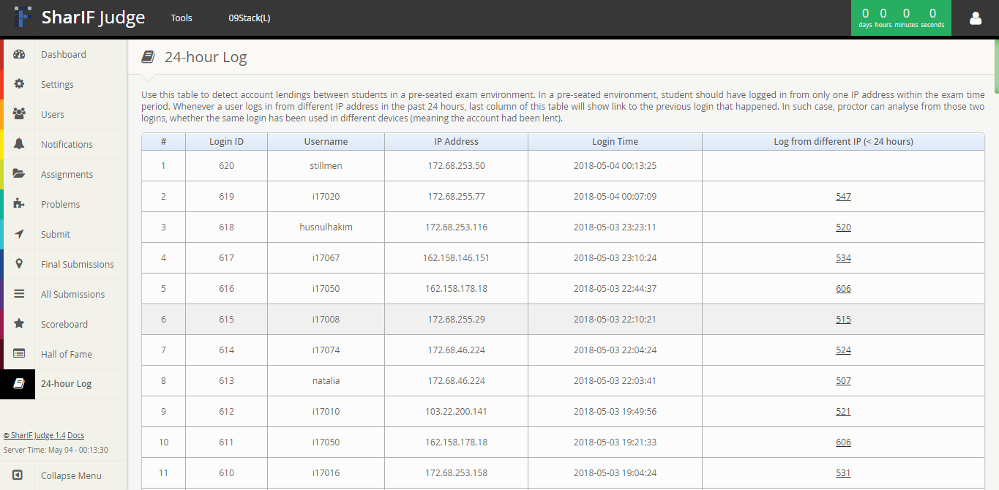

Logs
==============

Logs page contains records of participants logged in using different IP address in the past 24 hours. Whenever a participants logs in from different IP address in the past 24 hours, last column of this table will show link to the previous login that happened. In such case, proctor can analyse from those two logins, whether the same login has been used in different devices (meaning the account had been lent).

To access Logs page, you must login using account with admin role. Logs page is located at the bottom of the side menu. You will see this page:

